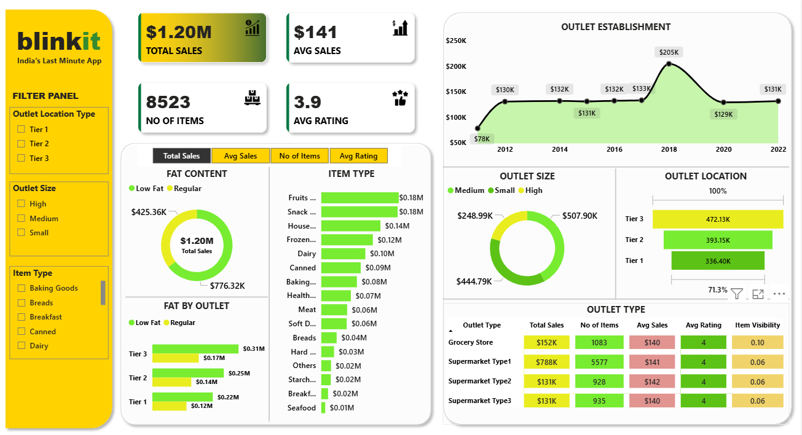

## 📷 Dashboard Preview

 

# 🛒 Blinkit Dashboard

## 📊 Overview  
This Power BI dashboard provides an in-depth analysis of **Blinkit's performance** across various product categories, outlet types, and geographical tiers.  
The goal is to offer actionable insights to optimize sales, understand consumer behavior, and enhance outlet efficiency.

---

## 🔑 Key Highlights

### 💰 Total Sales Overview
- **Total Sales:** $1.20M  
- **Average Sales:** $141  
- **Total Items Sold:** 8,523  
- **Average Rating:** 3.9  

---

### 🥛 Sales by Fat Content
- **Low-Fat Products:** $776.32K  
- **Regular-Fat Products:** $425.36K  

Low-fat items dominated the sales share, highlighting growing customer preference for healthier products.

---

### 🏙️ Location Performance (Tiers)
- **Tier 3 Cities:** $472.13K  
- **Tier 2 Cities:** $393.15K  
- **Tier 1 Cities:** $336.40K  

Tier 3 locations emerged as top performers, showing strong demand for quick deliveries outside major metropolitan areas.

---

### 📦 Category Insights
- **Top Categories:** Fruits & Vegetables, Snack Foods (each $0.18M)  
- **Other Strong Performers:** Household Products and Frozen Foods  

These categories indicate that customers rely heavily on Blinkit for essential and ready-to-eat items.

---

### 🏪 Outlet Performance
- **Top Outlet Size:** Medium-sized outlets with $507.90K in sales  
- **Growth Trend:** Steady growth from 2012–2022, peaking at $205K annually  

---

### 🏷️ Outlet Type Analysis
| Outlet Type         | Total Sale | No. of Items | Avg Sales | Avg Rating | Item Visibility |
|---------------------|-------------|--------------|------------|-------------|-----------------|
| Grocery Store       | $151.94K    | 1,083        | $140       | 4.0         | 113.57          |
| Supermarket Type 1  | $787.55K    | 5,577        | $141       | 4.0         | 338.65          |
| Supermarket Type 2  | $131.48K    | 928          | $142       | 4.0         | 56.62           |
| Supermarket Type 3  | $130.71K    | 935          | $140       | 4.0         | 54.80           |

Supermarket Type 1 leads across all key metrics, reflecting higher efficiency and consumer reach.

---

## 🎯 Dashboard Purpose and Utility
This dashboard delivers a **comprehensive view of Blinkit’s sales performance**, outlet productivity, and category-wise contributions. It helps stakeholders to:

- Identify top-performing products and locations  
- Optimize inventory based on high-demand items  
- Plan expansion strategies by outlet size and location  
- Track growth trends to forecast future revenue opportunities  

---

## 🚀 Conclusion
The visualized data empowers Blinkit to make **data-driven decisions**, enhance customer experience, and improve operational efficiency through continuous performance monitoring and trend analysis.

---

📈 **Tool Used:** Power BI  

